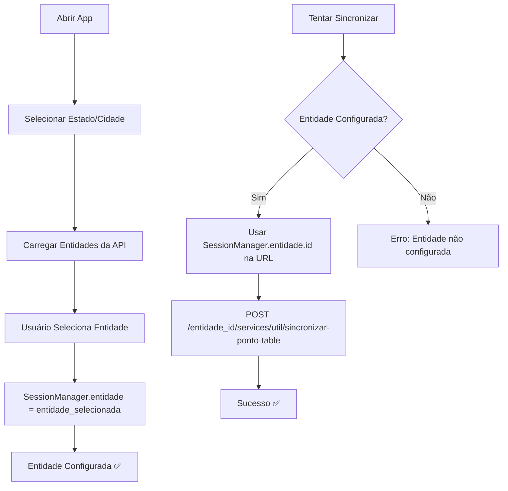

# 🔧 Configurar Entidade - Resolver Erro 400

## ❌ **Problema Identificado**

A API está retornando erro **400** com a mensagem:
```
"Cliente não configurado. Por favor, entrar em contato com a Itarget Tecnologia."
```

**Causa:** A entidade não está sendo enviada corretamente na URL da API.

## ✅ **Solução Implementada**

Agora a sincronização:
1. ✅ **Verifica se a entidade está configurada** antes de tentar sincronizar
2. ✅ **Usa `SessionManager.entidade?.id`** em vez de `localizacaoId`
3. ✅ **Mostra mensagem clara** se a entidade não estiver configurada
4. ✅ **Logs detalhados** para debug

## 🔍 **Como Verificar se a Entidade Está Configurada**

### **Verificar nos logs:**
```bash
adb logcat | grep "SYNC_DEBUG"
```

### **✅ Se estiver configurada, verá:**
```
SYNC_DEBUG: ✅ Entidade configurada:
SYNC_DEBUG:   🆔 ID: '15'
SYNC_DEBUG:   📝 Nome: 'PREFEITURA DE FORTALEZA'
SYNC_DEBUG: 🔗 URL da API: /15/services/util/sincronizar-ponto-table
```

### **❌ Se NÃO estiver configurada, verá:**
```
SYNC_DEBUG: ❌ === ERRO CRÍTICO: ENTIDADE NÃO CONFIGURADA ===
SYNC_DEBUG:   🔴 SessionManager.entidade: null
SYNC_DEBUG:   💡 SOLUÇÃO: Usuário deve ir em configurações e selecionar uma entidade
```

## 🔧 **Como Configurar a Entidade**

### **Método 1: Via Interface do App**
1. **Abra o app**
2. **Vá para a tela de configuração de entidade**
3. **Selecione sua cidade/estado**
4. **Escolha a entidade correta** (ex: Prefeitura, Câmara, etc.)
5. **Confirme a seleção**

### **Método 2: Verificar SessionManager**
A entidade fica armazenada em `SessionManager.entidade`:
```kotlin
SessionManager.entidade?.id     // Ex: "15"
SessionManager.entidade?.name   // Ex: "PREFEITURA DE FORTALEZA"
```

## 🧪 **Como Testar a Correção**

### **1. Verificar entidade atual:**
```bash
adb logcat | grep -E "(Entidade configurada|ENTIDADE NÃO CONFIGURADA)"
```

### **2. Fazer sincronização:**
```bash
adb logcat | grep "SYNC_DEBUG" | grep -E "(URL da API|Entidade corrigida)"
```

### **3. Ver se a URL está correta:**
```
ANTES: 🔗 URL da API: /{entidade}/services/util/sincronizar-ponto-table
DEPOIS: 🔗 URL da API: /15/services/util/sincronizar-ponto-table
```

## 📋 **Possíveis Status**

### ✅ **Entidade OK:**
```
✅ Entidade configurada:
  🆔 ID: '15'
  📝 Nome: 'PREFEITURA DE FORTALEZA'
🔗 URL da API: /15/services/util/sincronizar-ponto-table
📡 === RESPOSTA DA API ===
  📈 Status Code: 200
  ✅ Sucesso: true
```

### ❌ **Entidade não configurada:**
```
❌ === ERRO CRÍTICO: ENTIDADE NÃO CONFIGURADA ===
  🔴 SessionManager.entidade: null
  💡 SOLUÇÃO: Usuário deve ir em configurações e selecionar uma entidade
```

### ❌ **Entidade incorreta:**
```
🔗 URL da API: /wrong_id/services/util/sincronizar-ponto-table
📡 === RESPOSTA DA API ===
  📈 Status Code: 400
  🔴 ERRO ESPECÍFICO: Cliente não configurado
  💡 SOLUÇÃO: Verificar se a entidade 'wrong_id' está correta
```

## 🎯 **Fluxo de Configuração**



## 🚨 **Troubleshooting**

### **Problema:** "Cliente não configurado"
**Solução:** 
1. Verifique se `SessionManager.entidade` não é null
2. Configure a entidade via interface do app
3. Teste novamente

### **Problema:** URL ainda mostra `/{entidade}/`
**Solução:**
1. A correção já foi implementada
2. Compile o app novamente
3. Verifique os logs

### **Problema:** Entidade existe mas API rejeita
**Solução:**
1. Verifique se o ID da entidade está correto
2. Confirme com a Itarget se a entidade está ativa
3. Teste com outra entidade

---

## ✅ **Status da Correção**

- ✅ **Entidade agora vem do SessionManager**
- ✅ **Verificação antes da sincronização**  
- ✅ **Logs detalhados para debug**
- ✅ **Mensagens de erro claras**
- ✅ **URL da API corrigida**

**Teste novamente e verifique se a URL agora mostra o ID correto da entidade! 🚀** 