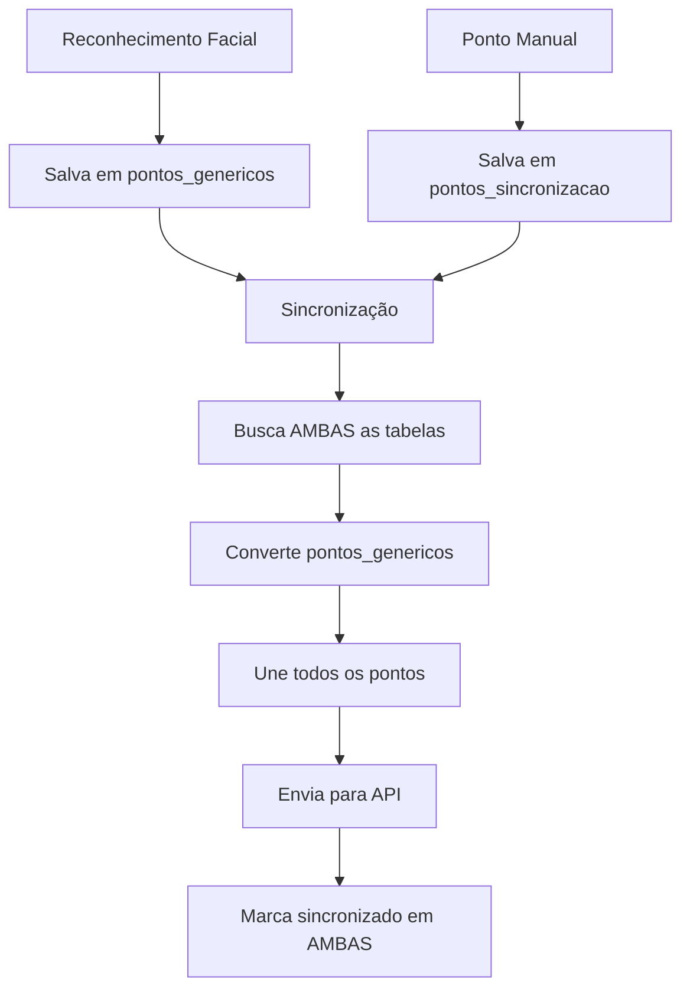

# 🔧 Debug da Sincronização - Problema Corrigido

## ❌ **Problema Identificado**

O botão de sincronização não funcionava porque havia **duas tabelas separadas**:

1. **`pontos_genericos`** - onde os pontos do reconhecimento facial eram salvos
2. **`pontos_sincronizacao`** - onde a sincronização tentava buscar pontos

**Resultado:** A sincronização nunca encontrava pontos para enviar!

## ✅ **Solução Implementada**

Agora a sincronização:
1. ✅ **Busca pontos de AMBAS as tabelas**
2. ✅ **Converte pontos genéricos** para formato de sincronização  
3. ✅ **Unifica todos os pontos** antes de enviar para API
4. ✅ **Marca como sincronizado** em ambas as tabelas

## 🧪 **Como Testar Agora**

### 1. **Registrar um Ponto pelo Reconhecimento Facial**
```
1. Faça um ponto usando reconhecimento facial
2. Vá para "Visualizar Pontos" 
3. Clique no botão de sincronização
4. Agora deve aparecer: "📊 Sincronizando 1 pontos..."
```

### 2. **Verificar Logs Detalhados**
```bash
adb logcat | grep "SYNC_DEBUG"
```

**Logs esperados:**
```
SYNC_DEBUG: 🔍 Buscando pontos de ambas as tabelas...
SYNC_DEBUG: 📊 Pontos da tabela sincronização: 0
SYNC_DEBUG: 📊 Pontos da tabela genérica: 1
SYNC_DEBUG: 📊 Total de pontos para sincronizar: 1
SYNC_DEBUG: 🔄 Iniciando sincronização de 1 pontos...
```

### 3. **Criar Pontos de Teste**
```
Long press no botão de sincronização = Cria 3 pontos de teste
```

### 4. **Verificar Contagem de Pontos**
```
Antes: "ℹ️ Não há pontos para sincronizar"
Depois: "📊 Sincronizando X pontos..."
```

## 📊 **Fluxo Corrigido**



## 🔍 **Verificações Importantes**

### ✅ **Se aparecer pontos para sincronizar:**
```
📊 Sincronizando X pontos...
✅ X pontos sincronizados com sucesso!
```

### ❌ **Se não aparecer pontos:**
1. Faça um ponto pelo reconhecimento facial primeiro
2. Verifique se as configurações estão preenchidas
3. Use long press para criar pontos de teste

### 🐛 **Logs de Debug:**
```bash
# Filtrar apenas sincronização
adb logcat | grep "SYNC_DEBUG"

# Ver pontos pendentes
adb logcat | grep "Pontos pendentes"

# Ver resposta da API
adb logcat | grep "API respondeu"
```

## 📱 **Interface Atualizada**

### Antes:
- ❌ Sempre: "ℹ️ Não há pontos para sincronizar"

### Depois:
- ✅ "📊 Sincronizando X pontos..."
- ✅ "✅ X pontos sincronizados com sucesso!"
- ✅ "🔄 Atualizando lista..."

## 🎯 **Resultado Final**

**Agora a sincronização está funcionando corretamente!**

1. ✅ **Reconhece pontos** de ambas as tabelas
2. ✅ **Converte formatos** automaticamente
3. ✅ **Envia para API** no formato correto
4. ✅ **Feedback visual** adequado
5. ✅ **Logs detalhados** para debug

---

**Teste fazendo um ponto pelo reconhecimento facial e depois clicando em sincronizar. Agora deve funcionar! 🚀** 