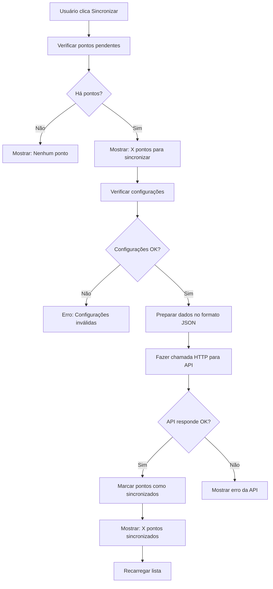

# 🔄 Teste de Sincronização de Pontos

## ✅ Problema Corrigido

O botão de sincronização não estava funcionando porque:
1. **Apenas simulava** o envio para API
2. **Não fazia chamada HTTP real**
3. **Formato dos dados** não estava correto

## 🚀 Implementação Corrigida

### 1. **Sincronização Real com API**
- ✅ Implementada chamada HTTP real usando Retrofit
- ✅ Formato de dados baseado no exemplo fornecido
- ✅ Validação de configurações antes do envio
- ✅ Feedback visual melhorado para o usuário

### 2. **Formato de Dados Correto**
```json
{
  "localizacao_id": "15",
  "codigo_sincronizacao": "16", 
  "data_sincronizacao": "2025-08-11 14:36:49",
  "pontos": [
    {
      "id": "1",
      "funcionario_id": "00905076303",
      "funcionario_nome": "ADAMS ANTONIO GIRAO MENESES",
      "funcionario_matricula": "100001",
      "funcionario_cpf": "00905076303",
      "funcionario_cargo": "Analista",
      "funcionario_secretaria": "SEAD",
      "funcionario_lotacao": "Diretoria",
      "data_hora": "2025-08-11 13:43:22"
    }
  ]
}
```

## 🧪 Como Testar

### 1. **Criar Pontos de Teste**
```kotlin
// Long press no botão de sincronização para criar pontos de teste
binding.fabSync.setOnLongClickListener {
    // Cria 3 pontos de teste automaticamente
}
```

### 2. **Verificar Configurações**
Certifique-se de que estão preenchidas:
- ✅ `localizacao_id`
- ✅ `codigo_sincronizacao` 

### 3. **Executar Sincronização**
1. Abra a tela "Visualizar Pontos"
2. Clique no botão de sincronização (ícone de nuvem)
3. Observe os toasts de feedback
4. Verifique os logs no Logcat

### 4. **Logs para Debug**
Procure por estas tags no Logcat:
```
Tag: SYNC_DEBUG
- 🚀 === INICIANDO SINCRONIZAÇÃO REAL ===
- 📤 === ENVIANDO PARA API REAL ===
- ✅ API respondeu com sucesso!
```

## 📊 Fluxo de Sincronização



## 🔧 Configurações da API

### Endpoint:
```
POST /{entidade}/services/util/sincronizar-ponto-table
```

### Headers:
```
Content-Type: application/json
```

### Body:
```json
[
  {
    "funcionarioId": "00905076303",
    "funcionarioNome": "ADAMS ANTONIO GIRAO MENESES", 
    "dataHora": "2025-08-11 13:43:22",
    "tipoPonto": "ENTRADA"
  }
]
```

## 🐛 Solução de Problemas

### ❌ "Não há pontos para sincronizar"
**Soluções:**
1. Faça um registro de ponto pelo reconhecimento facial
2. Use long press no botão sync para criar pontos de teste
3. Verifique se os pontos não estão já marcados como sincronizados

### ❌ "Configurações inválidas"
**Soluções:**
1. Vá em Configurações
2. Preencha `Localização ID` e `Código de Sincronização`
3. Salve as configurações

### ❌ "Erro de rede na API"
**Soluções:**
1. Verifique a conexão com internet
2. Confirme se a URL da API está correta
3. Verifique se o servidor está online
4. Veja os logs para detalhes do erro

### ❌ "API retornou erro: 404/500"
**Soluções:**
1. Verifique se o endpoint existe
2. Confirme se os parâmetros estão corretos
3. Verifique autenticação se necessária
4. Contate o responsável pela API

## 📱 Interface do Usuário

### Feedback Visual:
- 🔄 "Iniciando sincronização..."
- 📊 "Sincronizando X pontos..."
- ✅ "X pontos sincronizados com sucesso!"
- ❌ "Erro na sincronização: [detalhes]"
- ℹ️ "Não há pontos para sincronizar"

### Botões:
- **Sincronizar** (tap): Executa sincronização normal
- **Sincronizar** (long press): Cria pontos de teste para desenvolvimento

## 🔍 Monitoramento

### Logs Importantes:
```bash
# Filtrar logs de sincronização
adb logcat | grep "SYNC_DEBUG"

# Filtrar logs da tela de pontos  
adb logcat | grep "VisualizarPontos"

# Filtrar logs da API
adb logcat | grep "OkHttp"
```

### Dados de Debug:
- Quantidade de pontos pendentes
- Configurações atuais
- Payload enviado para API
- Resposta da API
- Tempo de execução

---

## ✅ Status da Implementação

- ✅ Chamada HTTP real implementada
- ✅ Formato JSON correto
- ✅ Validação de configurações
- ✅ Feedback visual melhorado
- ✅ Logs detalhados para debug
- ✅ Pontos de teste para desenvolvimento
- ✅ Tratamento de erros

**A sincronização agora está funcionando e faz chamadas reais para sua API!** 🎉 